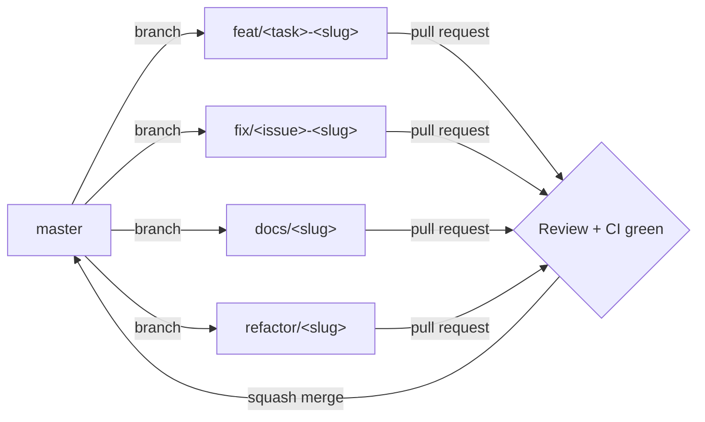

# Contributing to GIZA

This repository follows the process defined in _GIZA - 99 Development Playbook_ and _GIZA - 15 Implementation Roadmap_. Read those documents before committing code.

## Quick Rules

- **Do not modify numbered specifications** (`docs/specs/GIZA - 00` through `GIZA - 11`, `GIZA - 16`, `GIZA - 17`) unless explicitly instructed by the project owner.
- Use **Conventional Commits** (`feat:`, `fix:`, `docs:`, `refactor:`, `test:`, `chore:`).
- Open short-lived feature branches from `master` and merge via PR.
- Branch naming: `feat/m09-osiris-water`, `fix/hotspot-raycast`, `docs/adr-0004`, `refactor/scene-graph`.
- Every PR must pass typecheck, lint, tests, and the governance smoke test (no spec modifications, ADR index in sync).
- Every visible/traceable element requires evidence linkage per the **Definition of Scientific Done**.

## Branching Strategy

This repository follows a trunk-based workflow using short-lived feature branches.

- All work branches from `master`.
- Branch names: `feat/m09-osiris-water`, `fix/hotspot-raycast`, `docs/adr-0004`, `refactor/scene-graph`.
- Open a single, focused PR and merge with squash after at least one review and a green CI run.
- Delete branches after merge.
- `release/*` and `hotfix/*` branches are reserved for maintainers.

## Workflow

1. Pick or create a GitHub issue from the roadmap milestone.
2. Open a feature branch from `master`.
3. Implement the smallest change that satisfies the task and DoD.
4. Add or update tests.
5. Update relevant ADRs and documentation.
6. Open a PR using the template.
7. Merge only after review and CI green.

## Definition of Done (DoD)

- TypeScript strict mode passes (`npm run typecheck`).
- Lint and format pass (`npm run lint`, `npm run format:check`).
- Unit and integration tests pass (`npm run test`, `npm run test:integration`).
- Build passes (`npm run build`).
- Documentation updated if the change affects public APIs or architecture.

## Definition of Scientific Done (DoSD)

For any task producing a visible or traceable element (geometry, material, simulation parameter, confidence value):

- The element links to at least one `EV-` record and one `SRC-` record.
- A confidence value is assigned.
- Bibliographic provenance is present.
- The element is reviewable in the evidence panel.

## Getting Started

See `AGENTS.md` for the AI-coder quick-start and `docs/adr/README.md` for architecture decisions.
